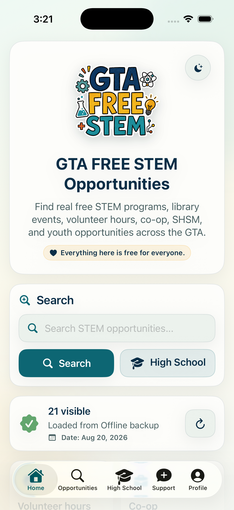
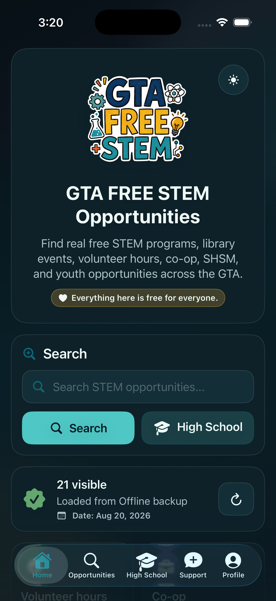
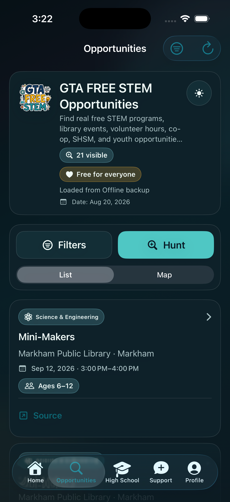
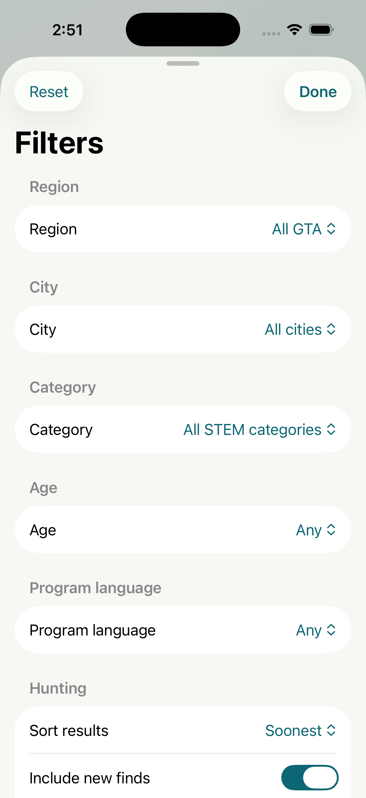
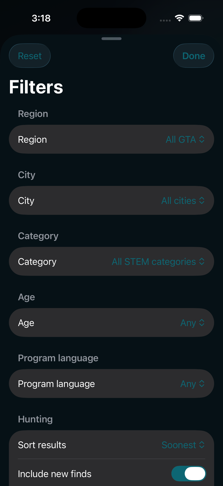
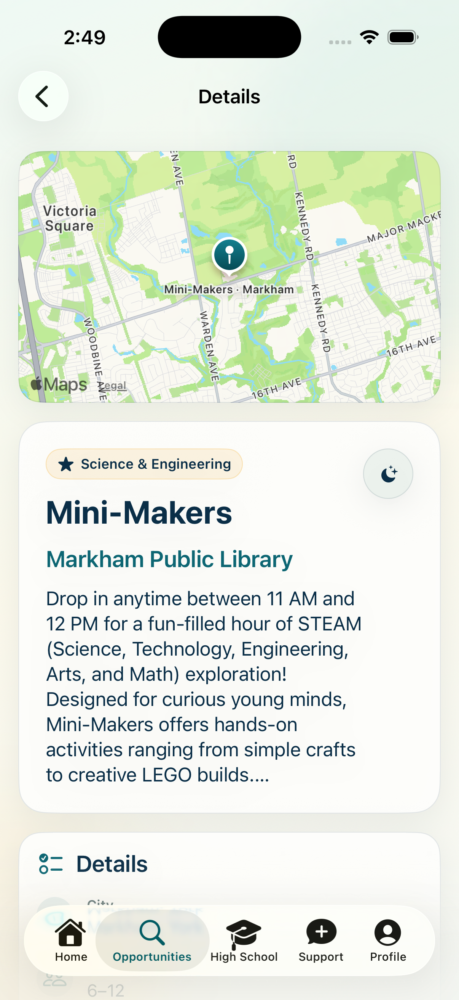
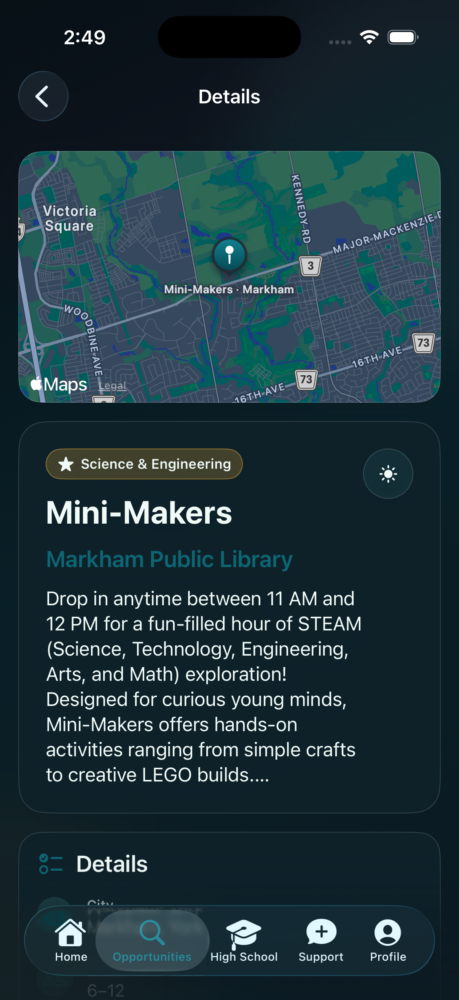
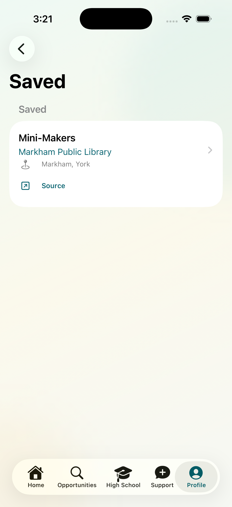
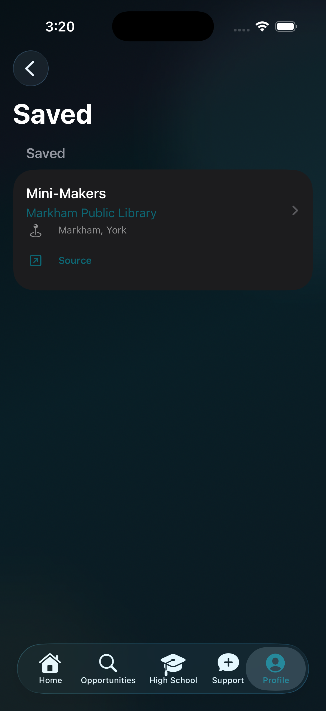

# GTA FREE STEM

## The iPhone experience

Discover free STEM opportunities through the native SwiftUI app. Explore, filter, inspect a program, and keep a personal shortlist on your device.

**Light and dark, screen by screen.** Select any screenshot to view the original at full size.

### Start your search

Open search or the high-school pathway from the home screen.

<table>
  <tr><th width="50%">Light</th><th width="50%">Dark</th></tr>
  <tr>
    <td align="center"><a href="docs/showcase/home-light.png"></a></td>
    <td align="center"><a href="docs/showcase/home-dark.png"></a></td>
  </tr>
</table>

### Browse opportunities

Scan program cards, check the feed status, and open a listing.

<table>
  <tr><th width="50%">Light</th><th width="50%">Dark</th></tr>
  <tr>
    <td align="center"><a href="docs/showcase/browse-light.png"></a></td>
    <td align="center"><a href="docs/showcase/browse-dark.png"></a></td>
  </tr>
</table>

### Find a better fit

Narrow opportunities by region, city, STEM category, age, and program language.

<table>
  <tr><th width="50%">Light</th><th width="50%">Dark</th></tr>
  <tr>
    <td align="center"><a href="docs/showcase/filters-light.png"></a></td>
    <td align="center"><a href="docs/showcase/filters-dark.png"></a></td>
  </tr>
</table>

### Inspect a program

Review the provider, description, and map before following a registration link.

<table>
  <tr><th width="50%">Light</th><th width="50%">Dark</th></tr>
  <tr>
    <td align="center"><a href="docs/showcase/details-light.png"></a></td>
    <td align="center"><a href="docs/showcase/details-dark.png"></a></td>
  </tr>
</table>

### Keep a shortlist

Revisit saved programs in the on-device opportunity library.

<table>
  <tr><th width="50%">Light</th><th width="50%">Dark</th></tr>
  <tr>
    <td align="center"><a href="docs/showcase/saved-light.png"></a></td>
    <td align="center"><a href="docs/showcase/saved-dark.png"></a></td>
  </tr>
</table>

Captured from the running iOS Simulator build on September 11, 2026. [Capture details and original image checksums](docs/showcase/README.md).

---

[](https://developer.apple.com/xcode/swiftui/)
[](https://developer.apple.com/testflight/)

GTA FREE STEM is a native SwiftUI app for finding free STEM opportunities across the Greater Toronto Area. It is built for iPhone, iPad, Mac Catalyst, and a paired Apple Watch companion.

## What It Does

- Browse, search, filter, sort, and map free GTA STEM opportunities without signing in.
- Search by keyword, city, region, age, category, language, high-school pathway, distance, volunteer hours, co-op/SHSM, mentorship, scholarships, equity focus, and new finds.
- Open provider registration links and Apple Maps directions when available.
- Save opportunities, a recent hunt, and an optional display-name Profile locally on the device.
- Delete the local Profile, saved opportunities, and personal hunt history from Settings.
- Refresh from the public source-backed opportunity feed, restore an on-device cache, and fall back to a bundled snapshot offline.
- Offer light/dark themes, Dynamic Type-friendly layouts, VoiceOver labels, multilingual UI, and right-to-left layout.

There is no online account, Sign in with Apple flow, in-app feedback form, or opportunity-submission service in build 1.0 (12).

## Data And Reliability

Primary live feed:

```text
https://raw.githubusercontent.com/rupayon123/gta-free-stem-opportunities/main/public/opportunities.json
```

The app validates public feed responses, caps response/cache size, and opens from the latest valid on-device full feed or bundled snapshot before refreshing the public feed on each cold launch. If neither local source is usable, it waits for the live feed. Active foreground data is revalidated after 15 minutes. Every remote source, including the primary GitHub feed and jsDelivr CDN mirror, must declare data no more than 14 days old; otherwise it is rejected. Seen-listing history is pruned after 120 days and known IDs are capped to avoid unbounded local growth.

The native app does not crawl websites in the background. Feed collection, source validation, updates, and archival belong to the companion data pipeline.

## Project Layout

- `GTAFreeSTEM/` — iPhone, iPad, and Mac Catalyst app source.
- `GTAFreeSTEMWatch/` — Watch companion, icon assets, and privacy manifest.
- `GTAFreeSTEMTests/` — unit and release-configuration coverage.
- `project.yml` — XcodeGen project definition.
- `docs/APP_STORE_SUBMISSION_PACKET.md` — App Store Connect source of truth.
- `docs/PUBLIC_RELEASE_RUNBOOK.md` — archive, TestFlight, and App Review handoff.

## Run And Verify

Open the tracked `GTAFreeSTEM.xcodeproj` in Xcode. The checked-in project is the release input and does not require XcodeGen; `project.yml` remains an optional maintenance definition whose generated diff must be reviewed if XcodeGen is used.

```bash
xcodebuild build \
  -project GTAFreeSTEM.xcodeproj \
  -scheme GTAFreeSTEM \
  -destination 'platform=iOS Simulator,name=iPhone 17'

xcodebuild test \
  -project GTAFreeSTEM.xcodeproj \
  -scheme GTAFreeSTEM \
  -destination 'platform=iOS Simulator,name=iPhone 17'

CHECK_APP_STORE_SCREENSHOTS=0 STRICT_TRANSLATION_CHECK=1 \
  bash docs/scripts/check-release-readiness.sh
```

## Privacy Defaults

- No sign-in or online user account is required.
- Profile name, saved opportunities, hunt state, settings, and public-feed cache remain on device.
- Nearby search requests one-time location only when the user asks; location is not sent to the public feed.
- No ads, purchases, third-party analytics, or crash-reporting SDKs are included.
- Both privacy manifests declare local UserDefaults use with reason `CA92.1`. The iOS/iPadOS/Mac Catalyst manifest also conservatively declares IP-derived Coarse Location and Other Diagnostic Data retained by feed providers; Watch makes no independent feed request and declares no collected data.
- The public feed uses HTTPS; provider links are normalized to HTTPS before opening.

## Release

Build 1.0 (12) is the current release candidate, pending its first TestFlight upload. Use `docs/TESTFLIGHT.md` to upload it for real-phone testing, then complete `docs/TESTFLIGHT_REAL_DEVICE_SIGNOFF.md`. TestFlight distribution and App Store release require Apple Developer Program eligibility; see the runbook for the no-cost personal-device alternative and fee-waiver eligibility.

## Open Source And Community

This project is available under the [MIT License](LICENSE). Contributions are
welcome, especially human-reviewed translations, accessibility improvements,
cross-platform testing, documentation, and focused bug fixes.

The MIT license covers project-owned source and documentation. Opportunity
descriptions, provider materials, and third-party names or marks remain subject
to their original sources and owners; the license does not grant trademark
endorsement rights.

- Read [CONTRIBUTING.md](CONTRIBUTING.md) before opening a pull request.
- Use [the Apple-platform localization guide](docs/LOCALIZATION.md) for language work.
- Follow the [Code of Conduct](CODE_OF_CONDUCT.md).
- Report vulnerabilities privately as described in [SECURITY.md](SECURITY.md).
