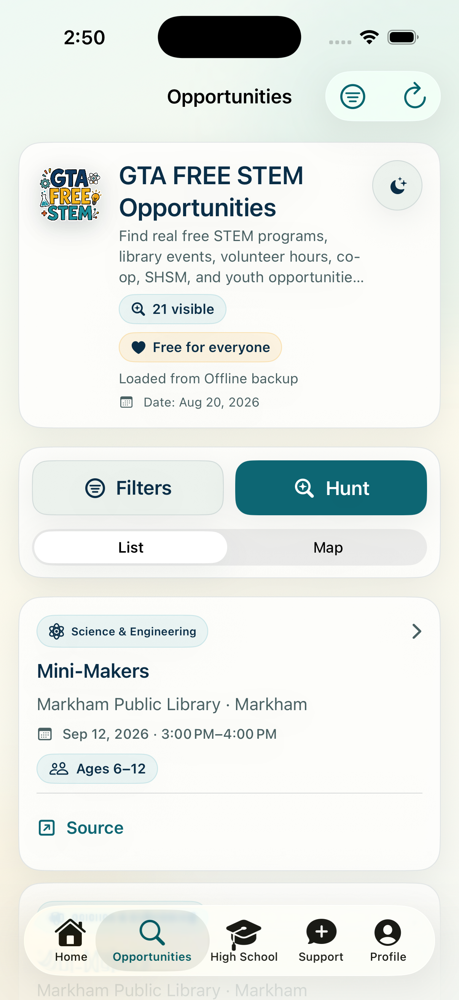
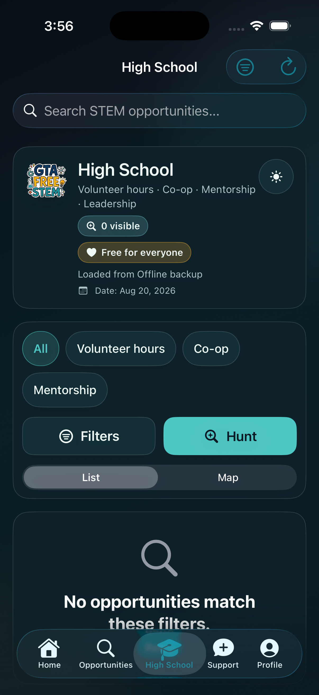
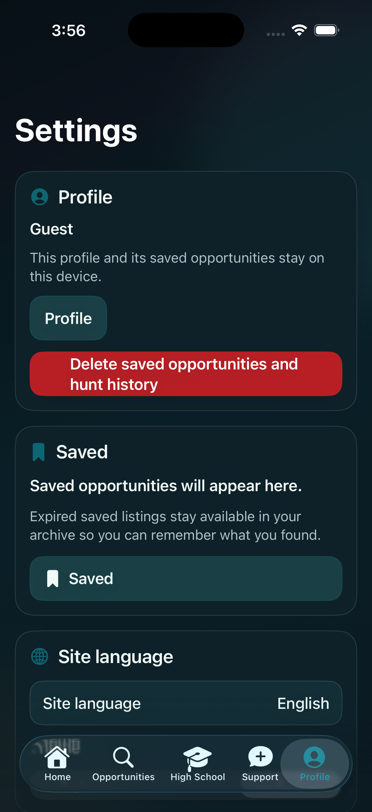

# GTA FREE STEM for iOS

I'm building GTA FREE STEM to make free STEM programs easier to find across the Greater Toronto Area. This is the native SwiftUI app for iPhone, with iPad, Mac Catalyst, and an Apple Watch companion in the project.

[Android app](https://github.com/rupayon123/gta-free-stem-android) | [Web app](https://github.com/rupayon123/gta-free-stem-opportunities) | [Try the website](https://gta-free-stem.vercel.app/)

## The iPhone experience

<table>
<tr><th width="50%">Home</th><th width="50%">Search</th></tr>
<tr><td align="center"><a href="docs/showcase/home.png"></a></td><td align="center"><a href="docs/showcase/search.png"></a></td></tr>
<tr><th>High School Search</th><th>Profile</th></tr>
<tr><td align="center"><a href="docs/showcase/hs-search.png"></a></td><td align="center"><a href="docs/showcase/profile.png"></a></td></tr>
</table>

## About the app

Search by location, age, category, and language, or use the High School section for volunteer hours, co-op, and mentorship. Open a program's source page, get directions with Apple Maps, and keep a shortlist on your device.

There's no account to create. Your profile, saved opportunities, searches, and settings stay on-device. Nearby search requests your location only when you ask for it. The app has no ads, purchases, or third-party analytics.

The app reads the public opportunity feed from the web repository and keeps a local cache for offline browsing. The feed pipeline handles source collection and updates; the native app doesn't crawl provider websites.

## Development status

Build 1.0 (12) is the recorded release candidate, with TestFlight upload and real-device signoff still pending. These screenshots are from the installed simulator build, not a new build of the latest source.

[Release runbook](docs/PUBLIC_RELEASE_RUNBOOK.md) | [TestFlight setup](docs/TESTFLIGHT.md) | [Device signoff](docs/TESTFLIGHT_REAL_DEVICE_SIGNOFF.md)

## Run locally

Open `GTAFreeSTEM.xcodeproj` in Xcode, select the `GTAFreeSTEM` scheme, and run it on an iOS 17 or newer simulator or device. The tracked project opens directly; XcodeGen is optional.

To build and run tests, replace the destination with a simulator installed on your Mac:

```bash
xcodebuild build -project GTAFreeSTEM.xcodeproj -scheme GTAFreeSTEM -destination 'platform=iOS Simulator,name=iPhone 17'
xcodebuild test -project GTAFreeSTEM.xcodeproj -scheme GTAFreeSTEM -destination 'platform=iOS Simulator,name=iPhone 17'
```

## Project layout

- `GTAFreeSTEM/`: iPhone, iPad, and Mac Catalyst app.
- `GTAFreeSTEMWatch/`: Apple Watch companion.
- `GTAFreeSTEMTests/`: tests.
- `docs/`: setup, privacy, and release notes.

## Contributing

Help with accessibility, translations, device testing, and bug fixes is welcome.

- [Contributing](CONTRIBUTING.md)
- [Localization](docs/LOCALIZATION.md)
- [Code of conduct](CODE_OF_CONDUCT.md)
- [Security](SECURITY.md)

## License

[MIT](LICENSE) for the app's source and documentation. Program descriptions and third-party names and materials belong to their respective owners.
